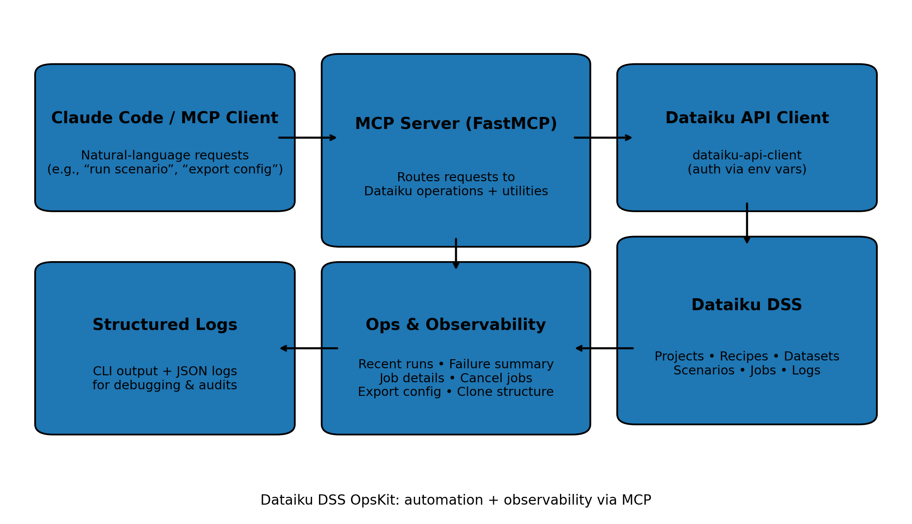

# Dataiku DSS OpsKit (MCP Server)

A lightweight **Model Context Protocol (MCP)** server that gives Claude Code (or any MCP client) safe, repeatable access to **Dataiku DSS** for day-to-day data engineering work: **create/update/run** recipes, datasets, scenarios, plus **monitoring and rollout utilities** for migrations and standardization.

Built around **Python 3.11**, **FastMCP**, and **dataiku-api-client**.

---

## What this helps with

- **Pipeline delivery**: automate common DSS actions (new datasets/recipes, scenario triggers, builds) without clicking through the UI.
- **Ops & debugging**: pull recent runs, failure summaries, job details and logs when a scenario breaks.
- **Migrations / rollouts**: export project config, duplicate a project skeleton, and standardize setup across DSS instances.

---

## Architecture



---

## Requirements

- Python **3.11+**
- Access to a Dataiku DSS instance + an API key with appropriate permissions

---

## Quick start

### 1) Install

```bash
python -m venv .venv
# macOS/Linux
source .venv/bin/activate
# Windows (PowerShell)
# .venv\Scripts\Activate.ps1

pip install -e .
```

### 2) Configure environment

Create a `.env` (or export env vars in your shell):

```bash
DSS_HOST=https://your-dss-instance:10000
DSS_API_KEY=your-api-key
DSS_INSECURE_TLS=true   # set true only for self-signed certs
```

### 3) Run the server

```bash
python scripts/mcp_server.py --help
python scripts/mcp_server.py --transport stdio
```

Verbose logging:

```bash
python scripts/mcp_server.py --transport stdio --verbose
```

---

## Claude Code setup (optional)

Register the MCP server:

```bash
claude mcp add dataiku-dss-opskit \
  -e DSS_HOST=https://your-dss-instance:10000 \
  -e DSS_API_KEY=your-api-key \
  -e DSS_INSECURE_TLS=true \
  -- python scripts/mcp_server.py
```

---

## What you can do (tool coverage)

This server exposes **34 callable actions** grouped into practical buckets:

- **Recipes**: create/update/delete/run, plus extract and validate code recipes
- **Datasets**: create/update/delete/build, schema inspection, basic metrics
- **Scenarios**: create/update/delete, triggers, run, clone, fetch run logs/steps
- **Monitoring**: recent run history, failure rollups, job details, cancel running jobs
- **Rollout utilities**: list connections + code envs, export project config (JSON/YAML), duplicate project structure

---

## Example flows

### Build + validate a dataset after a change
- Rebuild a dataset recursively.
- Inspect schema/metrics for quick sanity checks.
- If it fails, fetch job details + logs in one shot.

### Standardize a new project quickly
- Duplicate a clean project skeleton.
- Add scenario triggers (daily/hourly).
- Export config for review or environment diffing.

---

## Repo layout

```text
dataiku_mcp/
  client.py                 # DSS connection wrapper (env-based)
  server.py                 # MCP server definition + registration
  tools/
    recipes.py              # recipe operations
    datasets.py             # dataset operations
    scenarios.py            # scenario operations
    advanced_scenarios.py   # logs, steps, cloning
    code_development.py     # code extraction + validation + dry-run checks
    project_exploration.py  # project flow + search + sampling
    environment_config.py   # connections, code envs, variables
    monitoring_debug.py     # run history, job details, cancellations
    productivity.py         # export config + duplicate structure + bulk updates
scripts/
  mcp_server.py             # CLI entrypoint
docs/
  architecture.png
```

---

## Security notes

- **Do not commit API keys.** Use environment variables or a local `.env`.
- All actions run under the permissions of the **DSS user tied to the API key**.
- If you must use `DSS_INSECURE_TLS=true`, keep it to dev/test and remove it in production.

---

## Troubleshooting

**Connection fails**
- Confirm `DSS_HOST` includes the port (often `:10000`)
- Confirm the API key is valid and has project permissions
- If your DSS uses a self-signed cert, set `DSS_INSECURE_TLS=true`

**Permission denied**
- The API key needs access to the target project(s), plus the specific object types you are operating on (recipes/datasets/scenarios)

**No recent job history**
- Some DSS versions/instances restrict job APIs; monitoring utilities degrade gracefully where possible

---

## Development

```bash
pip install -e ".[dev]"
ruff check .
black .
pytest
```
